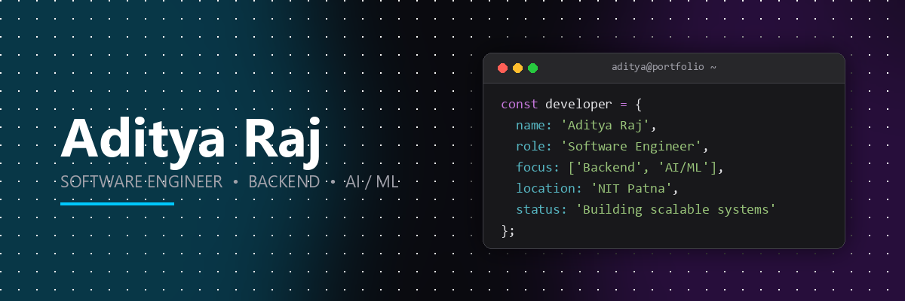

<!-- ========================================================== -->
<!--                       BANNER                               -->
<!-- ========================================================== -->

  

<h1 align="center">
Hi 👋 I'm Aditya Raj
</h1>

<h3 align="center">
Software Engineer • Backend Developer • AI Integration Enthusiast
</h3>

Building scalable software systems using modern web technologies, cloud platforms, and practical AI.

---

## 👨‍💻 Engineering Journey

I'm a final-year B.Tech student in Electronics and Communication Engineering at the National Institute of Technology (NIT) Patna.

My interests lie in Software Development, Backend Engineering, and Applied AI, where I enjoy designing complete products that solve real-world problems.

Over the past few years, I've worked on full-stack applications, backend systems, cloud deployment, machine learning, and competitive programming. Every project I build focuses on writing clean, maintainable, and production-oriented software.

I believe software engineering is more than writing code—it's about understanding problems, designing scalable solutions, and continuously improving through iteration.

---

## 🚀 Current Focus

I'm currently building **TalentMind AI**, an AI-powered career preparation platform that helps students become interview-ready through intelligent resume analysis and personalized career guidance.

### Current Features

- Resume Parsing
- ATS Score Analysis
- Job Description Matching
- AI Career Mentor
- AI Mock Interviews
- Personalized Learning Roadmaps
- Docker Containerization
- Azure & Vercel Deployment

---

## 🌱 Currently Exploring

- System Design Fundamentals
- Backend Scalability
- Docker & Cloud Deployment
- AI Integration in Web Applications
- Production Ready MERN Applications

---

## 🛠 Tech Stack

### 💻 Languages

### 🎨 Frontend

### ⚙️ Backend

### 🗄️ Database

### ☁️ Cloud & DevOps

### 🤖 AI / ML

- TensorFlow
- Scikit-Learn
- OpenCV
- Gemini API
- NumPy
- Pandas
- Matplotlib

### 🧰 Tools

- VS Code
- Postman
- MongoDB Atlas
- Cloudinary
- Docker Hub
- Azure App Service
- Vercel

---

# 🏆 Engineering Highlights

- 🎓 Final Year B.Tech (ECE) @ National Institute of Technology Patna
- 🔬 Research Intern @ IIT Patna (Medical Image Segmentation)
- 🌍 Google Student Ambassador
- 🤖 Amazon ML Summer School 2026
- 🏆 Flipkart GRiD 7.0 Semi-finalist
- 💻 CodeChef 4★ (1800+)
- ⚔️ LeetCode Knight (1900 Max)
- 🚀 Codeforces Pupil (1329 Max)

---

# 📈 Competitive Programming

| Platform | Achievement |
|----------|-------------|
| CodeChef | ⭐ 4 Star (1800+) |
| LeetCode | Knight (1900 Max) |
| Codeforces | Pupil (1329 Max) |
| Problems Solved | 1500+ total with 100+ contest |

---

# 💡 Areas of Interest

- Software Engineering
- Backend Development
- Full Stack Development
- Artificial Intelligence
- Cloud Computing
- REST API Design
- System Design
- Competitive Programming

---

# ⭐ Featured Work

<table>
<tr>
<td width="50%">

### 🚀 TalentMind AI

**AI-Powered Career Preparation Platform**

A full-stack AI platform that helps students improve their resumes, analyze ATS scores, match job descriptions, prepare for interviews, and receive personalized AI-powered career guidance.

**Tech Stack**

React • Node.js • Express.js • MongoDB • Gemini API • JWT • Cloudinary • Docker • Azure • Vercel

🔗 **Repository:** *(Add GitHub Link)*

🌐 **Live Demo:** *(Add after deployment)*

</td>

<td width="50%">

### 🎬 Movie Review Classifier

**Sentiment Analysis using ML & DL**

Built multiple NLP models for sentiment classification, exposed predictions through FastAPI, containerized with Docker, and deployed on Microsoft Azure.

**Tech Stack**

Python • TensorFlow • Scikit-learn • FastAPI • Docker • Azure

🔗 **Repository:** *(Add GitHub Link)*

</td>

</tr>

<tr>

<td width="50%">

### 😷 Face Mask Detection

**Deep Learning based Computer Vision**

CNN-based face mask detection system with nearly 97% accuracy, deployed using Streamlit for real-time predictions.

**Tech Stack**

Python • TensorFlow • OpenCV • Streamlit

🔗 **Repository:** *(Add GitHub Link)*

🌐 **Live Demo:** *(Add Streamlit Link)*

</td>

<td width="50%">

### 🤖 AI Chatbot

**Gemini Powered Desktop Assistant**

Desktop AI assistant supporting multiple AI personas, PDF export, and intelligent conversations using Gemini API.

**Tech Stack**

Python • Gemini API • Tkinter

🔗 **Repository:** *(Add GitHub Link)*

</td>

</tr>

</table>

---

# 📚 Research & Learning

I strongly believe that learning never stops. Alongside building projects, I continuously explore modern software engineering practices, backend architecture, artificial intelligence, cloud technologies, and research-driven development.

Current learning areas include:

- Backend Architecture
- System Design
- Large Language Models (LLMs)
- Cloud Deployment
- Distributed Systems
- AI Integration into Web Applications

---

# 📜 Certifications

- Stanford Machine Learning Specialization
- Advanced Learning Algorithms (Stanford)
- Neural Networks & Deep Learning (Stanford)
- Microsoft Azure Fundamentals
- Google Technical Support Fundamentals
- Amazon ML Summer School 2026

---

# 🌍 Open Source & Community

I enjoy collaborating with developer communities, participating in technical events, and contributing through learning, mentoring, and project development.

- Google Student Ambassador
- IEEE Student Branch (ML Team)
- GirlScript Summer of Code
- Flipkart GRiD 7.0 Semi-finalist

---

# 📊 GitHub Analytics

---

# 🤝 Let's Connect

---

# 💬 Let's Build Something Meaningful

I'm always interested in collaborating on projects related to

- Software Engineering
- Backend Development
- AI-powered Applications
- Open Source
- Cloud Technologies

If you're working on something exciting, feel free to connect.

---

### Thanks for visiting my profile!

⭐ If you like my work, consider starring the repositories that interest you.

